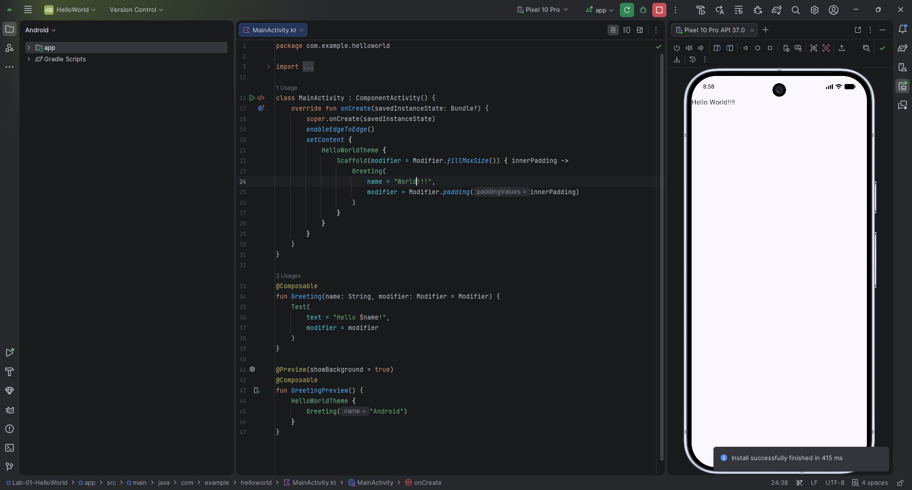

# Lab 01 — Hello World Android Application

## Aim
To develop a simple Android application using Jetpack Compose that displays a greeting message on the screen, demonstrating the basic structure of a modern Android project.

## Concept / Technology Used
- **Android Studio** — IDE used to build and run the app
- **Kotlin** — programming language
- **Jetpack Compose** — declarative UI toolkit used to build the screen (no XML layout files)
- **Composable functions** (`@Composable`) — reusable UI building blocks
- **Scaffold** — provides the basic screen structure/layout container
- **Activity lifecycle** — `MainActivity` extends `ComponentActivity`, and `setContent {}` renders the Compose UI

## Scenario
This app demonstrates the minimal building block of any Android application — a single screen that greets the user with a message ("Hello World!!!"). It serves as a starting point before building more complex, multi-screen apps in later labs.

## Folder Structure
```
Lab-01-HelloWorld/
├── app/
│   ├── src/
│   │   ├── main/
│   │   │   ├── java/com/example/helloworld/
│   │   │   │   ├── MainActivity.kt
│   │   │   │   └── ui/theme/
│   │   │   ├── res/
│   │   │   └── AndroidManifest.xml
│   │   └── androidTest/
│   └── build.gradle.kts
├── gradle/
├── build.gradle.kts
├── settings.gradle.kts
├── screenshots/
│   ├── output.png
│   ├── test_case_1.png
│   ├── test_case_2.png
│   └── test_case_3.png
└── README.md
```

## How to Run
1. Clone the repo and open `Lab-01-HelloWorld` in Android Studio
2. Let Gradle sync complete
3. Select a device/emulator from the device dropdown
4. Click **Run ▶**

## Output


## Test Case

| # | Test Case | Screenshot |
|---|-----------|------------|
| 1 | App launches and displays the greeting text with **Name & USN** on screen | `screenshots/test_case_1.png` |

## Conclusion
This experiment helped understand the basic structure of a Jetpack Compose Android app — how `MainActivity` uses `setContent {}` to render composable UI, and how a simple `Text` composable can display dynamic content on screen.
