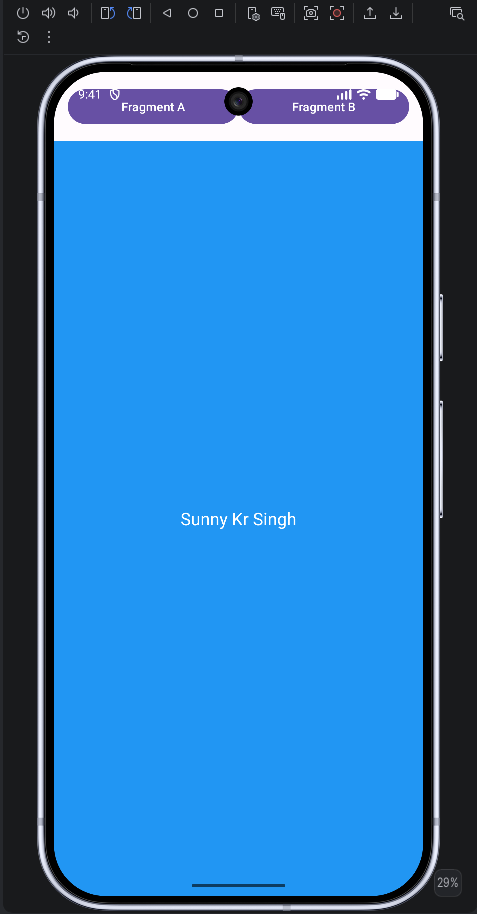

# Lab 03 — Fragments for Flexible UI

## Aim
To build an Android application using Fragments to create a flexible UI.

## Concept / Technology Used
- **Android Studio** — IDE used to build and run the app
- **Kotlin** — programming language
- **Fragments** — modular, reusable UI components that can be swapped in and out of an Activity without recreating it
- **FragmentContainerView** — a placeholder in the layout that hosts whichever fragment is currently active
- **FragmentManager** — manages fragment transactions (`replace()`, `commit()`) to swap fragments at runtime

## Scenario
This app demonstrates how Fragments enable a flexible, modular UI. A single Activity hosts a `FragmentContainerView`, and two buttons let the user switch between `FragmentA` (blue screen) and `FragmentB` (green screen) instantly, without restarting the Activity — showing how different UI sections can be swapped in and out dynamically, the same way a real app might switch between different content panels or screens within one Activity.

## Folder Structure
```
Lab03FragmentDemo/
├── app/
│   ├── src/
│   │   ├── main/
│   │   │   ├── java/com/example/lab03fragmentdemo/
│   │   │   │   ├── MainActivity.kt
│   │   │   │   ├── FragmentA.kt
│   │   │   │   └── FragmentB.kt
│   │   │   ├── res/
│   │   │   │   └── layout/
│   │   │   │       ├── activity_main.xml
│   │   │   │       ├── fragment_a.xml
│   │   │   │       └── fragment_b.xml
│   │   │   └── AndroidManifest.xml
│   │   └── androidTest/
│   └── build.gradle.kts
├── gradle/
├── build.gradle.kts
├── settings.gradle.kts
├── screenshots/
│   ├── output.png
│   ├── test_case_1.png
│   ├── test_case_2.png
│   └── test_case_3.png
└── README.md
```

## How to Run
1. Clone the repo and open `Lab03FragmentDemo` in Android Studio
2. Let Gradle sync complete
3. Select a device/emulator from the device dropdown
4. Click **Run ▶**
5. Tap **Fragment A** / **Fragment B** buttons to switch between fragments

## Output


App launches with **Fragment A** (blue) loaded by default into the `FragmentContainerView`.

## Test Cases

| # | Test Case | Screenshot |
|---|-----------|------------|
| 1 | Tapping **Fragment B** button swaps the container to **Fragment B** (green) | `screenshots/test_case_1.png` |
| 2 | Tapping **Fragment A** button again swaps back to **Fragment A** (blue), confirming the container updates both ways without restarting the Activity | `screenshots/test_case_2.png` |
| 3 | Fragment displaying **Name & USN** on screen | `screenshots/test_case_3.png` |

## Conclusion
This experiment helped understand how Fragments allow a single Activity to host multiple, independently swappable pieces of UI. Using `FragmentManager.beginTransaction().replace()` made it possible to change the visible content instantly, demonstrating the flexibility Fragments bring compared to a fixed, single-layout Activity.
