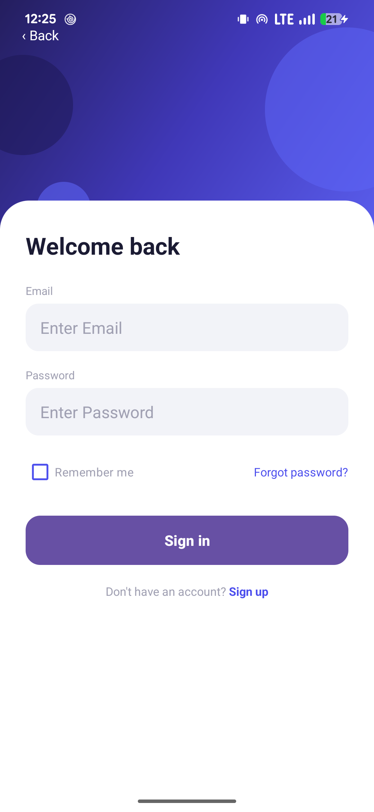
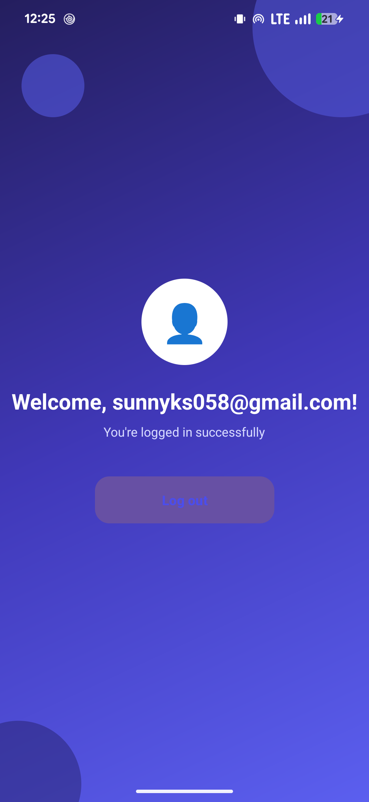
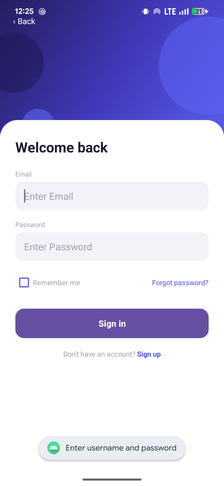
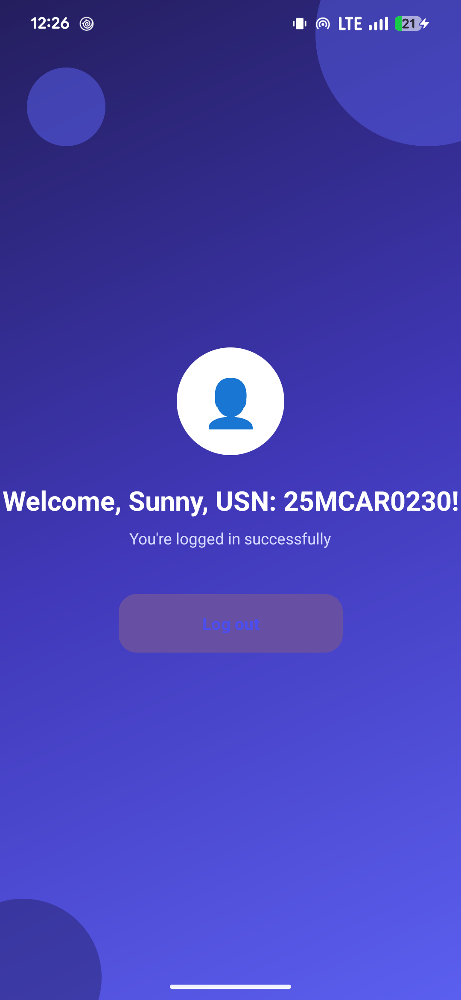

# Lab 04 — Linking Activities using Intents

## Aim
Implement an Android Application to demonstrate linking activities using intents.

## Concept / Technology Used
- Android Studio
- Kotlin
- XML Views (no Jetpack Compose)
- `Intent` (explicit intent) to navigate from one Activity to another
- `putExtra()` / `getStringExtra()` to pass data (the entered username) between Activities
- `ConstraintLayout` for screen layout and view positioning
- Custom drawable resources (`shape` drawables) for the gradient hero background, decorative circles, rounded input fields, and rounded buttons

## Scenario
The app presents a login-screen-style UI in `MainActivity`, where the user enters an email/username and a password and taps **Sign in**. On tapping Sign in, the app validates that both fields are filled, then creates an explicit `Intent` targeting `SecondActivity` and attaches the entered username as an extra. `SecondActivity` reads this extra and displays a personalized welcome message, demonstrating how data is passed from one Activity to another using Intents.

## Folder Structure
```
Lab04IntentDemo/
├── app/
│   ├── build.gradle.kts
│   └── src/
│       ├── main/
│       │   ├── AndroidManifest.xml
│       │   ├── java/com/example/lab04intentdemo/
│       │   │   ├── MainActivity.kt
│       │   │   └── SecondActivity.kt
│       │   └── res/
│       │       ├── layout/
│       │       │   ├── activity_main.xml
│       │       │   └── activity_second.xml
│       │       ├── drawable/
│       │       │   ├── bg_button_rounded.xml
│       │       │   ├── bg_button_rounded_white.xml
│       │       │   ├── bg_card_top_rounded.xml
│       │       │   ├── bg_field_rounded.xml
│       │       │   ├── bg_gradient_hero.xml
│       │       │   ├── circle_avatar.xml
│       │       │   ├── circle_decor_dark.xml
│       │       │   ├── circle_decor_light.xml
│       │       │   ├── ic_launcher_background.xml
│       │       │   └── ic_launcher_foreground.xml
│       │       └── values/
│       │           ├── colors.xml
│       │           ├── strings.xml
│       │           └── themes.xml
│       ├── androidTest/java/com/example/lab04intentdemo/ExampleInstrumentedTest.kt
│       └── test/java/com/example/lab04intentdemo/ExampleUnitTest.kt
├── gradle/
├── screenshots/
│   ├── output.png
│   ├── test_case_1.png
│   ├── test_case_2.png
│   └── test_case_3.png
├── build.gradle.kts
├── settings.gradle.kts
└── README.md
```

## How to Run
1. Clone this repository to your local machine.
2. Open Android Studio and select **Open**, then navigate to and select the `Lab04IntentDemo` folder.
3. Wait for Gradle to sync the project (Android Studio will do this automatically).
4. Select a target device — an emulator or a physical device connected via USB debugging.
5. Click **Run ▶** to build and launch the app.

## Output


*The login screen shown when the app is first launched.*

## Test Cases

| Test Case | Description | Expected Result | Screenshot |
|-----------|-------------|------------------|------------|
| Test Case 1 | Successful login — enter a valid email and password, then tap **Sign in** | The app navigates to the Welcome screen, displaying the username entered on the login screen |  |
| Test Case 2 | Empty field validation — tap **Sign in** with the email or password field left empty | A Toast message appears asking the user to enter both username and password; the app does not navigate |  |
| Test Case 3 | Welcome screen showing Name & USN — enter `Sunny, USN: 25MCAR0230` as the username and tap **Sign in** | The Welcome screen displays the personalized message containing the name and USN: `Sunny, USN: 25MCAR0230` |  |

## Conclusion
This experiment demonstrated how two Activities in an Android application can be linked using an explicit Intent. It showed that data entered by the user in one Activity (`MainActivity`) can be reliably passed to and retrieved in another Activity (`SecondActivity`) using `putExtra()` and `getStringExtra()`. This forms the foundation for building multi-screen Android applications where information needs to flow between different parts of the app.
