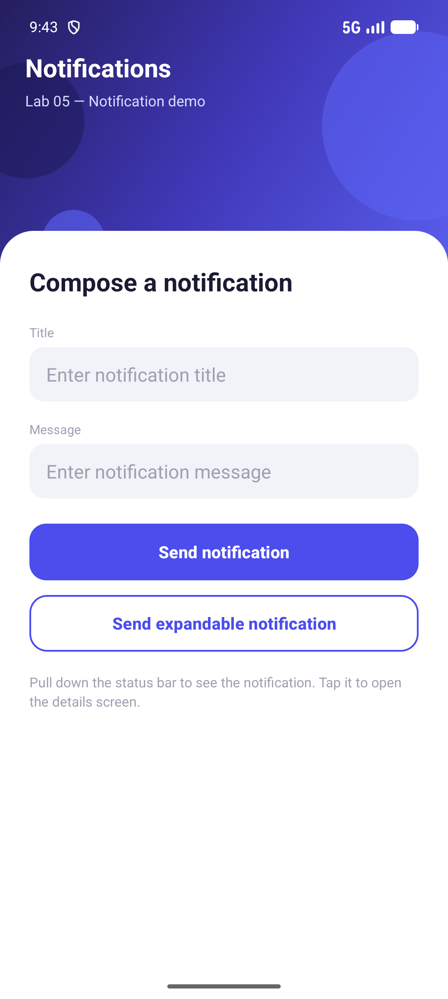
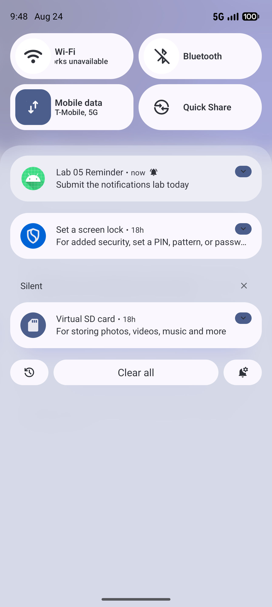
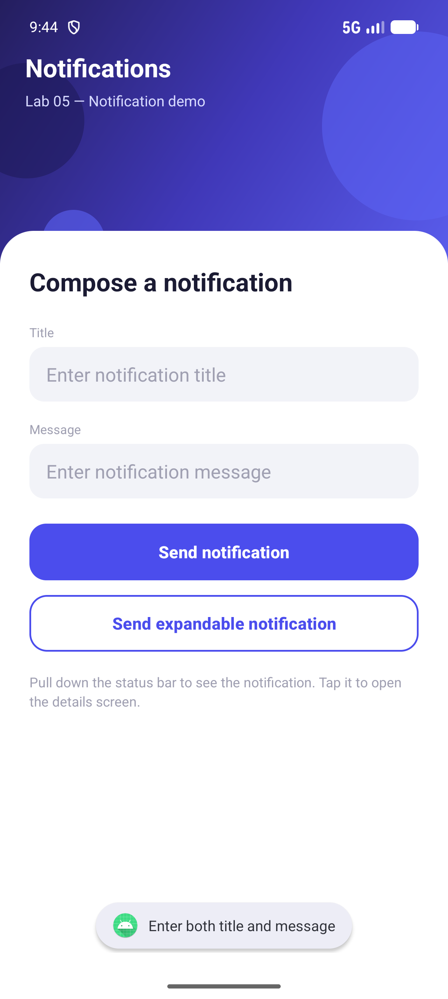
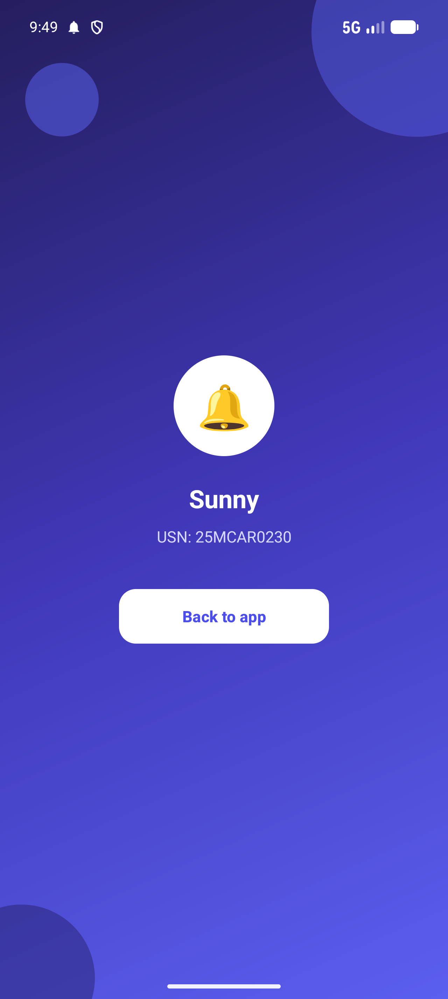
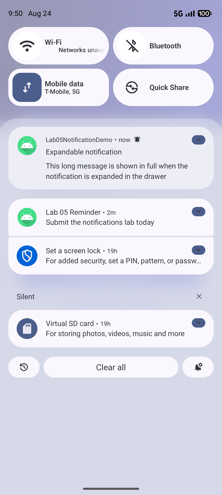

# Lab 05 — Displaying Notifications in Android

## Aim
Develop an application for displaying notifications in Android.

## Concept / Technology Used
- Android Studio
- Kotlin
- XML Views (no Jetpack Compose)
- `NotificationChannel` — mandatory grouping/behaviour container for notifications on Android 8.0 (API 26) and above
- `NotificationCompat.Builder` — builds the notification (small icon, title, text, priority, auto-cancel)
- `NotificationManagerCompat.notify()` — posts the built notification to the system status bar
- `NotificationCompat.BigTextStyle` — expandable notification style that shows the full message when pulled open
- `PendingIntent` — lets the system launch `DetailActivity` on the app's behalf when the notification is tapped
- Runtime permission `POST_NOTIFICATIONS` — required from Android 13 (API 33) onwards, requested using `registerForActivityResult(ActivityResultContracts.RequestPermission())`
- `ConstraintLayout` for screen layout, with custom `shape` drawables for the gradient hero panel, decorative circles, rounded fields, and rounded buttons

## Scenario
`MainActivity` shows a small "compose a notification" form — a title field, a message field, and two buttons. On launch, the app creates its notification channel and asks for the `POST_NOTIFICATIONS` permission. When the user fills both fields and taps **Send notification**, the app builds a notification with the entered title and message and posts it to the status bar. **Send expandable notification** posts the same notification using `BigTextStyle`, so a long message can be expanded to its full length in the notification drawer. Tapping any of these notifications fires a `PendingIntent` that opens `DetailActivity`, which displays the same title and message — showing the complete flow from creating a notification to handling the user tapping it.

## Folder Structure
```
Lab05NotificationDemo/
├── app/
│   ├── build.gradle.kts
│   └── src/
│       ├── main/
│       │   ├── AndroidManifest.xml
│       │   ├── java/com/example/lab05notificationdemo/
│       │   │   ├── MainActivity.kt
│       │   │   └── DetailActivity.kt
│       │   └── res/
│       │       ├── layout/
│       │       │   ├── activity_main.xml
│       │       │   └── activity_detail.xml
│       │       ├── drawable/
│       │       │   ├── bg_button_outlined.xml
│       │       │   ├── bg_button_rounded.xml
│       │       │   ├── bg_button_rounded_white.xml
│       │       │   ├── bg_card_top_rounded.xml
│       │       │   ├── bg_field_rounded.xml
│       │       │   ├── bg_gradient_hero.xml
│       │       │   ├── circle_avatar.xml
│       │       │   ├── circle_decor_dark.xml
│       │       │   ├── circle_decor_light.xml
│       │       │   ├── ic_notification.xml
│       │       │   ├── ic_launcher_background.xml
│       │       │   └── ic_launcher_foreground.xml
│       │       └── values/
│       │           ├── colors.xml
│       │           ├── strings.xml
│       │           └── themes.xml
│       ├── androidTest/java/com/example/lab05notificationdemo/ExampleInstrumentedTest.kt
│       └── test/java/com/example/lab05notificationdemo/ExampleUnitTest.kt
├── gradle/
├── screenshots/
│   ├── output.png
│   ├── test_case_1.png
│   ├── test_case_2.png
│   ├── test_case_3.png
│   └── test_case_4.png
├── build.gradle.kts
├── settings.gradle.kts
└── README.md
```

## How to Run
1. Clone this repository to your local machine.
2. Open Android Studio and select **Open**, then navigate to and select the `Lab05NotificationDemo` folder.
3. Wait for Gradle to sync the project (Android Studio will do this automatically).
4. Select a target device — an emulator or a physical device connected via USB debugging.
5. Click **Run ▶** to build and launch the app.
6. Allow the notification permission prompt shown on first launch, then enter a title and message and tap **Send notification**.

## Output


*The notification compose screen shown when the app is first launched.*

## Test Cases

| Test Case | Description | Expected Result | Screenshot |
|-----------|-------------|------------------|------------|
| Test Case 1 | Simple notification — enter a title and message, then tap **Send notification** | The notification appears in the status bar and notification drawer with the entered title and message |  |
| Test Case 2 | Empty field validation — tap **Send notification** with the title or message field left empty | A Toast message appears asking the user to enter both title and message; no notification is posted |  |
| Test Case 3 | Notification tap showing Name & USN — send a notification titled `Sunny` with the message `USN: 25MCAR0230`, then tap the notification | `DetailActivity` opens and displays the same title and message: `Sunny` / `USN: 25MCAR0230` |  |
| Test Case 4 | Expandable notification — enter a long message and tap **Send expandable notification**, then expand the notification in the drawer | The notification expands (`BigTextStyle`) and shows the full message text instead of a single truncated line |  |

## Conclusion
This experiment demonstrated how an Android application creates and displays notifications. It showed that a notification channel must exist before a notification can be posted, that the `POST_NOTIFICATIONS` runtime permission must be granted on Android 13 and above, and that `NotificationCompat.Builder` together with `NotificationManagerCompat.notify()` is used to build and post the notification. Attaching a `PendingIntent` made the notification interactive — tapping it opened a specific Activity carrying the notification's data — which is the standard pattern real apps use to bring users from a notification back into the app.
