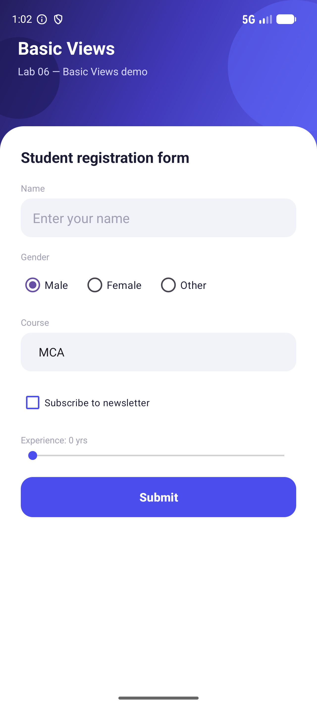
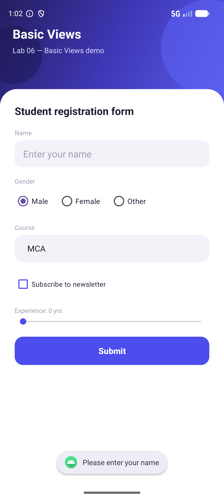
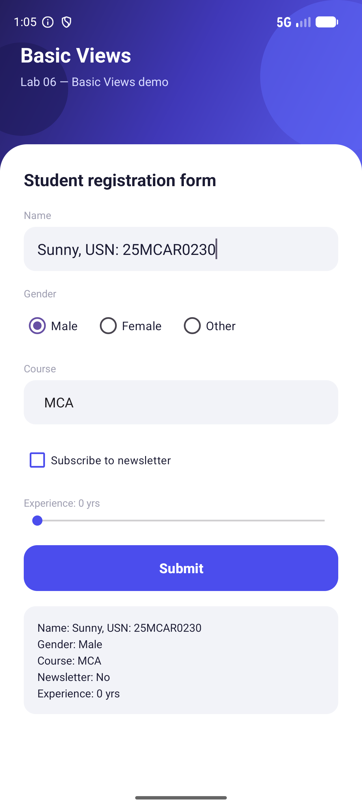

# Lab 06 — Develop an Android Application using Basic Views

## Aim
Develop an Android application using basic Views to demonstrate how common UI widgets are used to collect and display user input.

## Concept / Technology Used
- Android Studio
- Kotlin
- XML Views (no Jetpack Compose)
- `ConstraintLayout` for screen layout and view positioning
- `ScrollView` to keep a long form usable on small screens
- Basic Android Views: `EditText`, `RadioGroup`/`RadioButton`, `Spinner` (with `ArrayAdapter` bound to a string-array resource), `CheckBox`, `SeekBar`, `Button`, `TextView`
- `SeekBar.OnSeekBarChangeListener` to react to a widget's value changing live
- `Toast` for simple input validation feedback
- Custom drawable resources (`shape` drawables) for the gradient hero background, rounded input fields, and rounded button

## Scenario
The app presents a single-screen "Student registration form" in `MainActivity` that exercises a set of basic Views together: the user types their name in an `EditText`, picks a gender from a `RadioGroup`, selects a course from a `Spinner`, optionally checks a `CheckBox` to subscribe to a newsletter, and drags a `SeekBar` to indicate years of experience (the label above it updates live as the thumb moves). Tapping **Submit** validates that the name field isn't empty — if it is, a `Toast` asks the user to enter their name. Otherwise, the values from every widget are read and displayed as a formatted summary in a `TextView`, demonstrating how basic Views collect input and how that input is read back in Kotlin.

## Folder Structure
```
Lab06BasicViewsDemo/
├── app/
│   ├── build.gradle.kts
│   └── src/
│       ├── main/
│       │   ├── AndroidManifest.xml
│       │   ├── java/com/example/lab06basicviewsdemo/
│       │   │   └── MainActivity.kt
│       │   └── res/
│       │       ├── layout/
│       │       │   └── activity_main.xml
│       │       ├── drawable/
│       │       │   ├── bg_button_rounded.xml
│       │       │   ├── bg_button_rounded_white.xml
│       │       │   ├── bg_card_top_rounded.xml
│       │       │   ├── bg_field_rounded.xml
│       │       │   ├── bg_gradient_hero.xml
│       │       │   ├── circle_avatar.xml
│       │       │   ├── circle_decor_dark.xml
│       │       │   ├── circle_decor_light.xml
│       │       │   ├── ic_launcher_background.xml
│       │       │   └── ic_launcher_foreground.xml
│       │       └── values/
│       │           ├── colors.xml
│       │           ├── strings.xml (includes the `course_options` string-array)
│       │           └── themes.xml
│       ├── androidTest/java/com/example/lab06basicviewsdemo/ExampleInstrumentedTest.kt
│       └── test/java/com/example/lab06basicviewsdemo/ExampleUnitTest.kt
├── gradle/
├── screenshots/
│   ├── output.png
│   ├── test_case_1.png
│   ├── test_case_2.png
│   └── test_case_3.png
├── build.gradle.kts
├── settings.gradle.kts
└── README.md
```

## How to Run
1. Clone this repository to your local machine.
2. Open Android Studio and select **Open**, then navigate to and select the `Lab06BasicViewsDemo` folder.
3. Wait for Gradle to sync the project (Android Studio will do this automatically).
4. Select a target device — an emulator or a physical device connected via USB debugging.
5. Click **Run ▶** to build and launch the app.

## Output


*The registration form shown when the app is first launched, with default selections in place.*

## Test Cases

| Test Case | Description | Expected Result | Screenshot |
|-----------|-------------|------------------|------------|
| Test Case 1 | Successful submission — fill in the name, pick a gender, course, newsletter checkbox, and experience, then tap **Submit** | A summary of all the entered/selected values appears below the button |  |
| Test Case 2 | Empty field validation — leave the Name field empty and tap **Submit** | A Toast message appears asking the user to enter their name; no summary is shown |  |
| Test Case 3 | Summary showing Name & USN — enter `Sunny, USN: 25MCAR0230` as the name and tap **Submit** | The summary `TextView` displays the name field containing the name and USN: `Sunny, USN: 25MCAR0230` |  |

## Conclusion
This experiment demonstrated how to build a form-based screen using Android's basic Views — `EditText`, `RadioGroup`, `Spinner`, `CheckBox`, `SeekBar`, `Button`, and `TextView` — and how their values are read from Kotlin using `findViewById()`. It showed how a `SeekBar` listener can update the UI live, how a `Spinner` is populated from a string-array resource via an `ArrayAdapter`, and how simple validation with `Toast` improves the usability of a form before its data is consumed.
