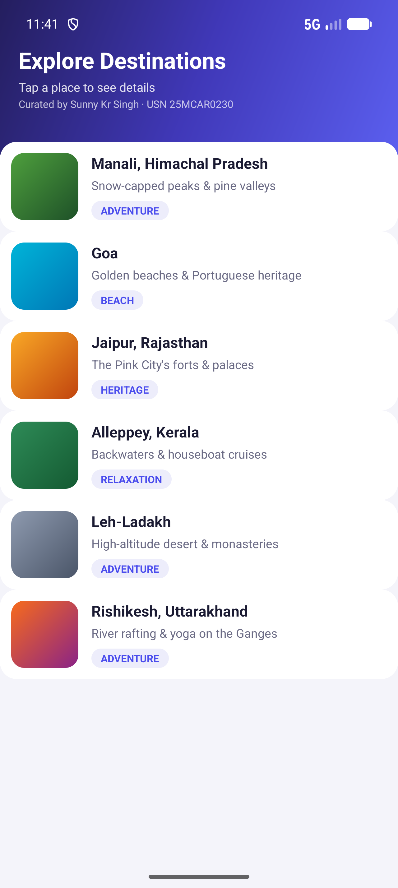
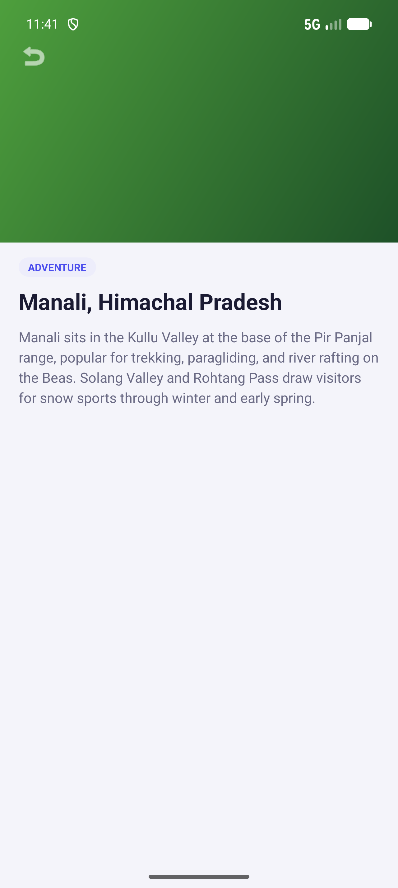
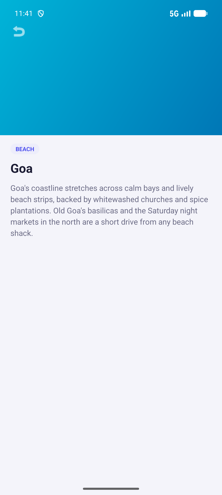

# Lab 08 — Create an Adaptive UI using ListView and ImageView

## Aim
Create an adaptive Android UI built around a `ListView` and `ImageView`, demonstrating how the same activity and data set can present themselves differently on a phone versus a tablet using resource-qualified layouts.

## Concept / Technology Used
- Android Studio
- Kotlin
- XML Views (no Jetpack Compose)
- `ListView` with a custom `BaseAdapter` (`DestinationAdapter`) and a view-holder pattern for efficient row recycling
- `ImageView` (`scaleType="centerCrop"`) for thumbnail and hero photos, backed by gradient shape drawables
- **Adaptive UI via resource qualifiers**: a single-pane `res/layout/activity_main.xml` for phones and a two-pane `res/layout-sw600dp/activity_main.xml` for tablets/large screens — Android picks the matching layout automatically at runtime based on smallest-width
- `Intent` with extras to navigate to a separate `DestinationDetailActivity` on phones
- Runtime layout detection in Kotlin (`findViewById` returning `null` for views absent from the current configuration) to decide whether to open a new Activity or update an in-place detail panel
- `ConstraintLayout`, `ScrollView`, custom `shape` drawables for rounded cards, chips, and gradient photo placeholders

## Scenario
`MainActivity` shows a scrollable `ListView` of Indian travel destinations — Manali, Goa, Jaipur, Alleppey, Leh-Ladakh, and Rishikesh — each row rendered by `DestinationAdapter` with a thumbnail `ImageView`, name, tagline, and category chip.

- **On a phone** (`res/layout/activity_main.xml`), the list fills the screen. Tapping a destination launches `DestinationDetailActivity` via an `Intent` carrying the destination's details as extras, showing a full-screen hero `ImageView`, category, name, and description.
- **On a tablet or any screen with `sw600dp` or wider** (`res/layout-sw600dp/activity_main.xml`), the same `MainActivity` instead renders a two-pane layout: the destination list on the left and a detail panel (hero image, category, name, description) on the right. Tapping a destination fills the right-hand panel in place — no navigation, no `DestinationDetailActivity` — because `MainActivity` detects at runtime whether the two-pane views exist in the inflated layout and branches accordingly.

This shows the classic Android "adaptive list-detail" pattern: one Activity and one data source, two layouts chosen automatically by the framework, and a small runtime check that adapts the navigation behaviour to match.

## Folder Structure
```
Lab08ListViewImageViewDemo/
├── app/
│   ├── build.gradle.kts
│   └── src/
│       ├── main/
│       │   ├── AndroidManifest.xml
│       │   ├── java/com/example/lab08listviewimageviewdemo/
│       │   │   ├── Destination.kt              # data class + repository of destinations
│       │   │   ├── DestinationAdapter.kt        # BaseAdapter for the ListView rows
│       │   │   ├── MainActivity.kt              # list + adaptive single/two-pane logic
│       │   │   └── DestinationDetailActivity.kt # phone-only detail screen
│       │   └── res/
│       │       ├── layout/
│       │       │   ├── activity_main.xml            # phone: single-pane list
│       │       │   ├── activity_destination_detail.xml
│       │       │   └── row_destination.xml           # ListView row (ImageView + text)
│       │       ├── layout-sw600dp/
│       │       │   └── activity_main.xml             # tablet: two-pane list + detail panel
│       │       ├── drawable/
│       │       │   ├── bg_card_rounded.xml, bg_chip_rounded.xml, bg_gradient_hero.xml
│       │       │   └── img_<destination>.xml, img_<destination>_hero.xml (gradient placeholders)
│       │       └── values/
│       │           ├── colors.xml, strings.xml, themes.xml
│       ├── androidTest/java/com/example/lab08listviewimageviewdemo/ExampleInstrumentedTest.kt
│       └── test/java/com/example/lab08listviewimageviewdemo/ExampleUnitTest.kt
├── gradle/
├── screenshots/
│   ├── output.png
│   ├── test_case_1.png
│   ├── test_case_2.png
│   └── test_case_3.png
├── build.gradle.kts
├── settings.gradle.kts
└── README.md
```

## How to Run
1. Clone this repository to your local machine.
2. Open Android Studio and select **Open**, then navigate to and select the `Lab08ListViewImageViewDemo` folder.
3. Wait for Gradle to sync the project (Android Studio will do this automatically).
4. Select a target device:
   - A **phone-sized emulator/device** to see the single-pane list → detail Activity flow.
   - A **tablet emulator/device (or any device with `sw600dp`+ width)** to see the two-pane adaptive layout.
5. Click **Run ▶** to build and launch the app.

## Output


*The "Explore Destinations" list shown when the app is first launched on a phone-sized screen.*

## Test Cases

| Test Case | Description | Expected Result | Screenshot |
|-----------|-------------|------------------|------------|
| Test Case 1 | Launch the app — name & USN | The `ListView` loads with all six destinations, each showing a thumbnail `ImageView`, name, tagline, and category chip; the header shows `Curated by Sunny Kr Singh · USN 25MCAR0230` |  |
| Test Case 2 | Tap **Manali, Himachal Pradesh** in the list | On a phone, `DestinationDetailActivity` opens via `Intent`, showing the Manali hero image, "ADVENTURE" chip, name, and description |  |
| Test Case 3 | Go back, then tap **Goa** in the list | The detail screen updates to show Goa's hero image, "BEACH" chip, name, and description, confirming the adapter and Intent extras work per-row |  |

## Conclusion
This experiment demonstrated how to build a scrollable, image-backed list with `ListView`, `ImageView`, and a custom `BaseAdapter`, and — more importantly — how to make that UI *adaptive*: by placing a second `activity_main.xml` under `res/layout-sw600dp/`, the same `MainActivity` and the same destination data automatically render as a single-pane list-then-detail flow on phones and a two-pane list-and-detail flow on tablets, with no manual screen-size checks beyond a `findViewById() != null` branch to decide how a tap should be handled.
